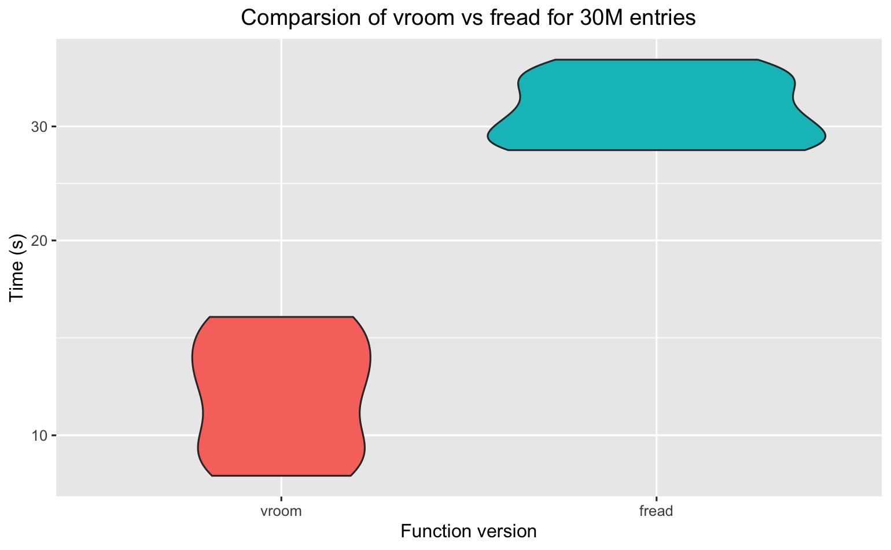

# Minutes for 25/01/22 

**DONM** (Date of next meeting): 2pm, 1st March - no longer SoHPC

# Present

 * Mario Antonioletti [MA]
 * Pau Navarro [PN]
 * Claudia Cabrera [CC]
 * Silvia Shen [SC]

## Actions

### New and ongoing

- [ ] **All (Claudia to lead)** choose a framework for packages to use from the output of benchmarks. Prioritise by memory and speed.

- [ ] **Mario** enumerate pros/cons of using data.table/tibbles
  * Interesting comparison: https://jozef.io/r917-fread-comparisons/
  * [stackoverflow](https://stackoverflow.com/questions/21435339/data-table-vs-dplyr-can-one-do-something-well-the-other-cant-or-does-poorly) states data.tables are faster especially for larger data sets.

- [ ] **Silvia** have a constructively critical look at genomicper.
  Problems installing across all platfroms, `reactome.db` seems to the issue (where the pathways come from). Need to use [bioconductor](https://bioconductor.org/packages/release/data/annotation/html/reactome.db.html) to install.

- [ ] **Claudia** clarify what packages come from CRAN and which come bioconductor.

- [ ] **Claudia** try running the 30M data set (16Gb memory).

- [ ] **Mario** try running the 30M data set (32Gb memory).
  Results from Microbenchmarks

  ```
                                                                 expr      min       lq       max neval    mean   median        uq
   read.table(file = infile, header = TRUE, stringsAsFactors = FALSE) 93.55874 95.22300  106.35863     599.07242 97.39790 102.82382
                          read_table(file = infile, col_types = cols) 56.47857 57.23174   71.40905     563.71495 65.56512  67.89029
                                                 fread(file = infile) 30.55904 33.09605 34.83237 35.52654  36.6708138.30937     5
   
  ```

  `read.table` and `read_table` produce `tibbles`while `fread`produces a `data.table`.

  

  A different set of runs comparing `fread` and `vroom`:

  ```
                                    expr       min        lq     mean   median       uq      max neval
   vroom(file = infile, col_types = cols)  8.660256  9.525121 11.82057 11.97287 14.35921 15.23637    10
                     fread(file = infile) 27.573730 27.976746 31.91760 31.26587 35.73686 38.04025    10
  ```

  

- [ ] **Pau**/**Silvia** find the best way of reading the 30M data set.

- [ ] **Claudia** Come up with a simple circos plot.

- [ ] **Pau** compare what we choose the best merging function solution in R against an SQL solution within  R.

### Completed

- [X] **Pau** save a copy of the 30M data set on eddie.

```bash
[pnavarro@node2f23(eddie) genomicper]$ pwd  
/exports/igmm/eddie/genomicper  
[pnavarro@node2f23(eddie) genomicper]$ ls -lrt | tail -2  
-rw------- 1 pnavarro igmm_datastore_genomicper 1375802511 Dec 14 13:43 SNP_Table_Annotation_ALL.txt  
-rw------- 1 pnavarro igmm_datastore_genomicper  604293838 Dec 14 13:58 pvals_ALL.txt
[pnavarro@node2f23(eddie) genomicper]$ gzip -v9 pvals_ALL.txt
pvals_ALL.txt:   59.7% -- replaced with pvals_ALL.txt.gz
[pnavarro@node2f23(eddie) genomicper]$ gzip -v9 SNP_Table_Annotation_ALL.txt
SNP_Table_Annotation_ALL.txt:    78.9% -- replaced with SNP_Table_Annotation_ALL.txt.gz
[pnavarro@node2f23(eddie) genomicper]$
```


- [x] **Mario** Do a systematic profiling with the data we have. 
  Deprecate as trying to do this for the 30M data set.
- [x] **Mario** get Irem to confirm some of the profiling values.
  Deprecate this for now.
- [x] **Mario** send out actions for the next meeting.
- [x] **Irem** put the parallelism work she did in markdown.
## Notes

Talked about some preliminary results on 30M. Silvia (and Mario) had issues installing `genomicper` on eddie but this was because packages needed to be installed from locations other than CRAN - apparently Mario run into this problem before but he had no memory of it. Silvia will try to see if she can install on eddie.
