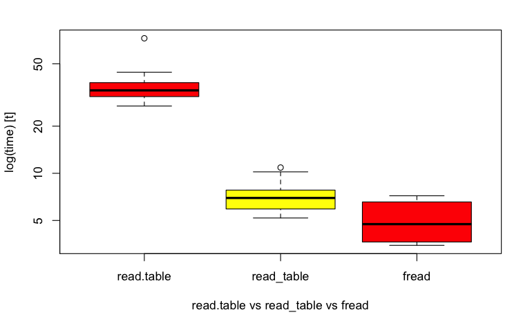
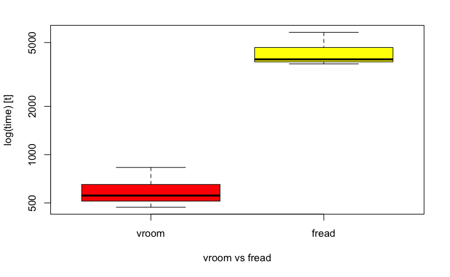
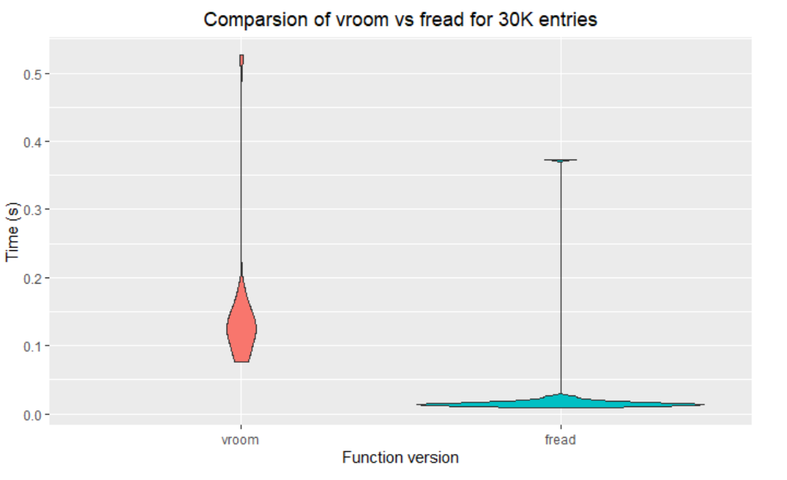
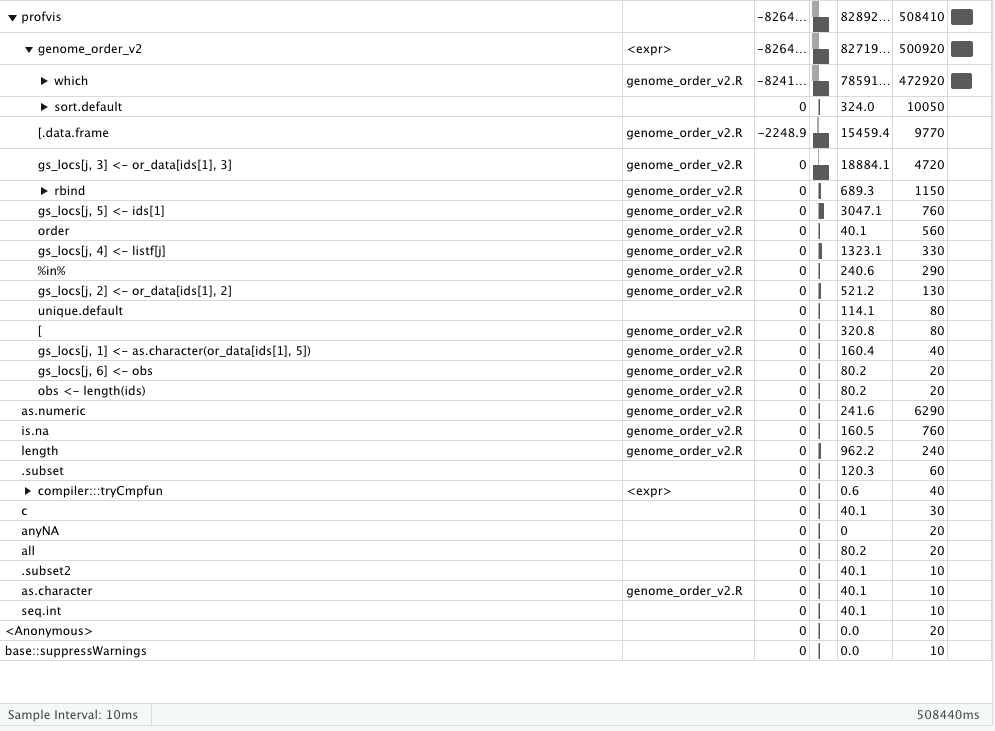
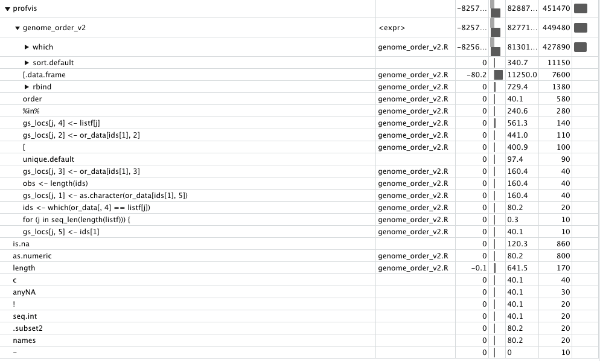
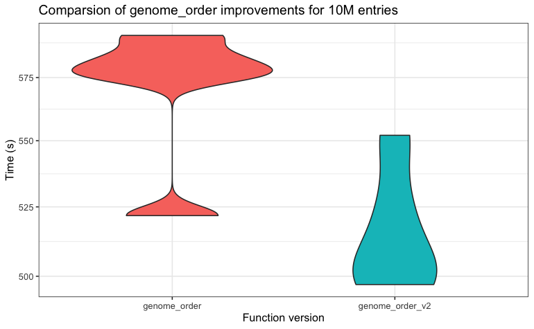
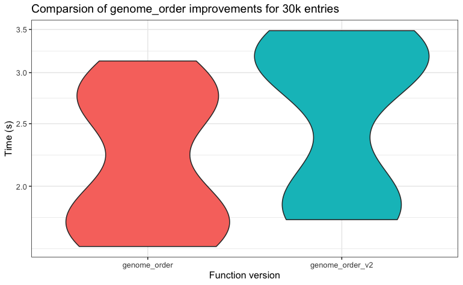
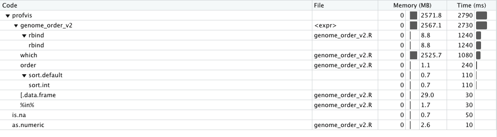
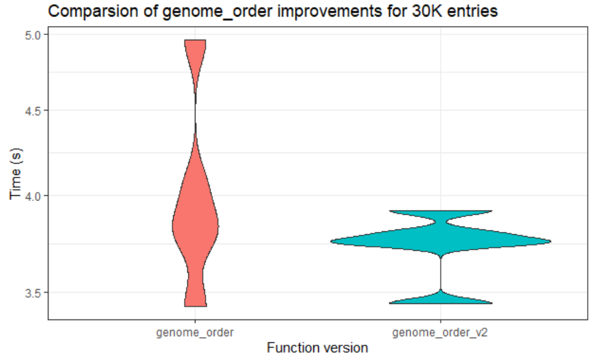
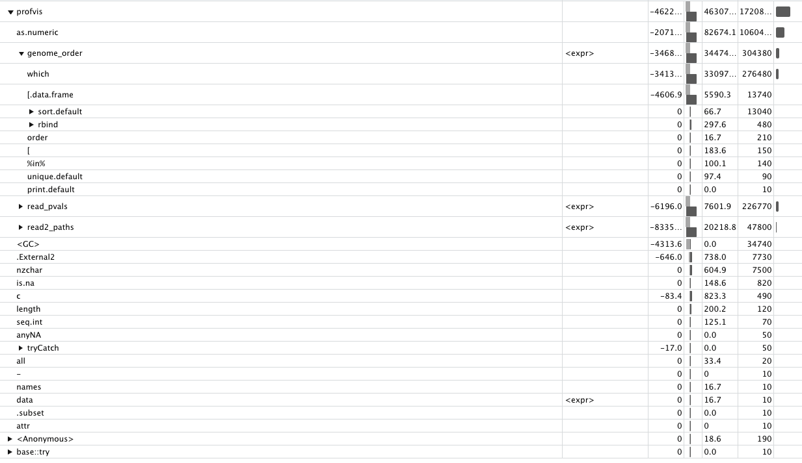

# Change Log

## Contents

* [Summary of changes](#summary-of-changes)
* [Input](#input)
* [Profiles](#profiles)

Keep track of changes.

## Summary of changes

## Input

Input of files was found to be quite expensive. The original code used `read.table`. Three alternative reading files were used:

* `read.table`
* `readr::read_table`
* `data.table::fread`
* `vroom`, see [here](https://www.tidyverse.org/blog/2019/05/vroom-1-0-0/)

For the first 3 cases reading the 8M data case `fread` gives the best performance (time in s):





`vroom` is clearly faster for the 8M case but for the 30k data set `vroom` did not have the best performance:



We found two additional two problems with vroom:

* There was a `locale` issue on Windows on a machine with a Turkish locale `vroom::locale()` gave an error. We could not fix this in RStudio using a `.RProfile` file and setting the locale explicitly: `Sys.setlocale(category = "LC_ALL", locale = "Turkish")`. There was some connection with finding `tzdb`.
* Other problem was also on a windows system which seemed to be related to this [issue](https://github.com/r-lib/vroom/issues/40) - the data file needed to have an extra line at the end when read in by a windows machine. Once we explicitly added a new empty line the file read in ok.

On the call 03/08/21 it was decided that `vroom` gave the best performance but was introducing too many issues so we would go on to use `fread` from `data.table`. Irem would make the change. She would also investigate the use of alternatives to `rbind` that appeared to be faster (see [here](https://rstudio-pubs-static.s3.amazonaws.com/406521_7fc7b6c1dc374e9b8860e15a699d8bb0.html)).

# Profiles

Add profiles in reverse chronological order.

## Profile 2

Look at a profile of `genome_order_v2` with the 8M (except that `all_data` is now 10520570) data set:



The run takes about 8m28s to run. Changes:

* Got rid of `which(is.na(all_data[, 2]) == TRUE)` and 

  ```R
  if (length(rm_rs) != 0) {
          all_data <- all_data[-c(rm_rs), ]
      }
  ```

  Replaced with:

  ```R
  all_data <- all_data[!is.na(all_data[, 2]), ]
  ```

* Introduced a `verbose = FALSE` to the function arguments and output only if required.

* Changed:

  ```R
   for (i in 7:colsf) {
          all_data[, i] <- as.numeric(as.character(all_data[, i]))
      }
  ```

  to

  ```R
     for (i in 7:colsf) {
          if (!is.factor(all_data[, i])) {
              next
          }        
          all_data[, i] <- as.numeric(as.character(all_data[, i]))
      }
  ```

  Even though I think these lines are not necessary.

* Changed:

  ```R
  or_data <- all_data
  or_data[, 2] <- as.character(or_data[, 2])
  
  lk <- c(1:50)
  lk <- as.character(lk)
  ## Numeric Chromosomes
  x <- which(or_data[, 2] %in% lk)
  nums <- or_data[x, ]
  ```

  to

  ```R
      or_data <- all_data
      or_data[, 2] <- as.character(or_data[, 2])
  
      lk <- as.character(1:50)
      ## Numeric Chromosomes
      x <- which(or_data[, 2] %in% lk)
      nums <- or_data[x, ]
      nums[, 2] <- as.numeric(nums[, 2])
  ```

  I am sure this can be simplified more but it risks breaking the code.

  Test that the results are still the same:

  ```R
  expect_equal(genome_order(all_data = all_data),
               genome_order_v2(all_data = all_data)
               )
  ```

  This seems to not produce an error. A new profile produced:

  

  This version takes 7m31s so it has saved almost a minute. Running a microbenchmark for 5 runs confirms that there is a slight improvement:

  

  For the the 30k data set though the improvements are not as clear:

  

  Profiling the routine for the 30k data sets gives the following profile:

  

  Irem run a microbenchmark with the same code and she gets the modified code and she finds it goes faster:

  

  on the call on the 03/08/21 it became apparent that we may not be comparing like with like - Irem might be using a `tibble` as she used `vroom` to read the data and Mario may have used a `data.table` as he read the data in using the original code.

### Profile 1

An early profile for the 8M data case using `profvis`.



The `as.numeric` appearance is interesting and comes from lines like 13-15 from `genome_order.R`:

```R
    for (i in 7:colsf) {
        all_data[, i] <- as.numeric(as.character(all_data[, i]))
    }
```

This is converting `factors` into `numeric` values. Probably no longer necessary as from R4.0.0 the default when reading in data would be `stringsAsFactors = FALSE`.

The `rbind()` is slower than the`rbindlist()` based on the [article](https://rstudio-pubs-static.s3.amazonaws.com/406521_7fc7b6c1dc374e9b8860e15a699d8bb0.html). It is in the `genome_order_v2.R`. But changing it causes a problem. Go back to the original `rbind()`.

